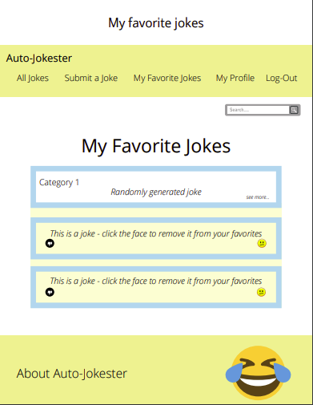

# Auto-Jokester

* App Link goes here

**App Summary**

Welcome to Auto-Jokester!

Auto-Jokester is your one-stop-shop for all things comedy! We feel that in these times, everyone needs a community where you can share a good laugh. On Auto-Jokester, you can submit your funniest jokes. Whether your looking for a specific joke or just want to know what’s trending in the comedy world, Auto-Jokester has something for you.

**User Stories** 

As a user...
* I want to be able to register with a username and password to create a user account
* I want to be able to log in once I am a registered user
* I want to be able to edit my user information in my profile
* I want to be able to view and edit my list of submitted jokes on my user profile 
* I want to be able to create/update/delete jokes that I have created
* I want to be able to explore jokes on the site by category 
* I want to be able to get a random joke in a category pulled from an API if one is available
* I want to be able to favorite and dislike jokes 
* I want to be able to view a daily joke and the most trending joke
* I want to be able to log out 

**Wireframes**

**ERD**

**APIs Used**
* https://icanhazdadjoke.com
* https://api.yomomma.info
* http://api.icndb.com/jokes/random
* https://v2.jokeapi.dev/

**Technologies Used**

* Python 
* Django 
* dotenv
* Heroku
* Pillow

**Team** 
* Jennifer Herrarte 
* Kaye Roberts
* Randy Elkins 
* Sean Yates

